


 

  
  
  
  

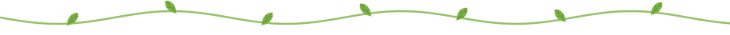

Sou **Dopa do Tereré**, desenvolvedor full-stack de Chapecó/SC e bacharelando em Ciência da Computação pela **Unochapecó**. Comando a **Type77 — Consultoria e Desenvolvimento** como CEO e sou sócio-proprietário da **ZROOT**, onde projeto e entrego sistemas completos para negócios reais: controle de acesso, estoque, atendimento, dashboards e automação com hardware.


|   |   |
|---|---|
| 🔭 **Construindo** | Sistemas de gestão e automação para clientes da Type77 |
| 🌱 **Estudando** | Arquitetura de sistemas, IoT e infraestrutura |
| 💬 **Pergunte-me sobre** | Sistemas sob medida, controle de acesso, catracas, automação e dashboards |
| ⚡ **Curiosidade** | Gosto de ver o software mexer no mundo físico: relés, catracas e armários |

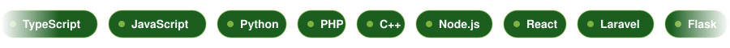

| | |
|:--|:--|
| **Linguagens** |  |
| **Back-end** |  |
| **Front-end** |  |
| **Dados & Infra** |  |
| **IoT** |  |

<table>
<tr>
<td><a href="https://github.com/dopa-do-terere/WMS-Inviolavel"></a></td>
<td><a href="https://github.com/dopa-do-terere/TIDESK"></a></td>
</tr>
<tr>
<td><a href="https://github.com/dopa-do-terere/zControl"></a></td>
<td><a href="https://github.com/dopa-do-terere/InvioKey"></a></td>
</tr>
<tr>
<td><a href="https://github.com/dopa-do-terere/InvioInstall"></a></td>
<td><a href="https://github.com/dopa-do-terere/ZIQ"></a></td>
</tr>
<tr>
<td><a href="https://github.com/dopa-do-terere/zapy_rasp"></a></td>
<td><a href="https://github.com/dopa-do-terere/DotOne-Dash"></a></td>
</tr>
</table>

> 🔒 A maior parte do que a Type77 e a ZROOT entregam é privada, sob contrato com clientes. O que está aqui é a vitrine pública.

<picture>
  <source media="(prefers-color-scheme: dark)" srcset="https://github-readme-stats.vercel.app/api?username=dopa-do-terere&show_icons=true&theme=github_dark&hide_border=true&include_all_commits=true&title_color=7CB342&icon_color=7CB342" />
  <source media="(prefers-color-scheme: light)" srcset="https://github-readme-stats.vercel.app/api?username=dopa-do-terere&show_icons=true&theme=default&hide_border=true&include_all_commits=true&title_color=1B5E20&icon_color=1B5E20" />
  
</picture>
<picture>
  <source media="(prefers-color-scheme: dark)" srcset="https://github-readme-stats.vercel.app/api/top-langs/?username=dopa-do-terere&layout=compact&theme=github_dark&hide_border=true&title_color=7CB342" />
  <source media="(prefers-color-scheme: light)" srcset="https://github-readme-stats.vercel.app/api/top-langs/?username=dopa-do-terere&layout=compact&hide_border=true&title_color=1B5E20" />
  
</picture>

  

<picture>
  <source media="(prefers-color-scheme: dark)" srcset="https://raw.githubusercontent.com/dopa-do-terere/dopa-do-terere/output/github-contribution-grid-snake-dark.svg" />
  <source media="(prefers-color-scheme: light)" srcset="https://raw.githubusercontent.com/dopa-do-terere/dopa-do-terere/output/github-contribution-grid-snake.svg" />
  
</picture>

Tem um projeto em mente, um sistema para tirar do papel ou só quer trocar uma ideia sobre tecnologia? Me chama por aqui:

  
  

